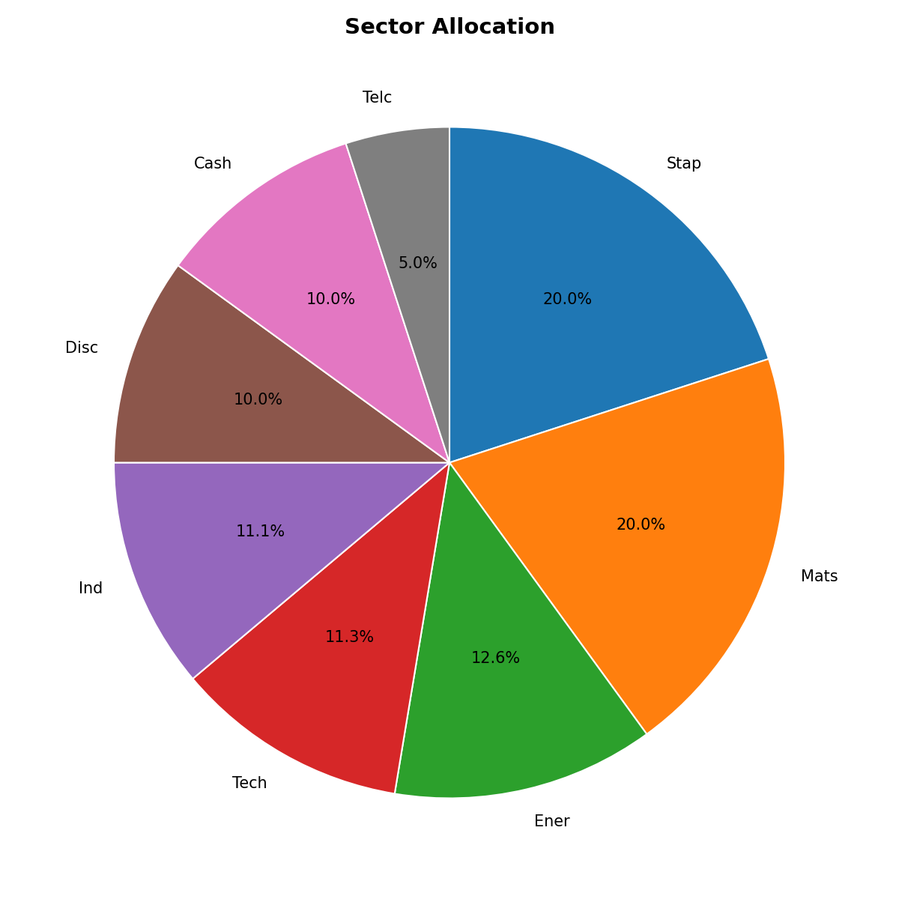
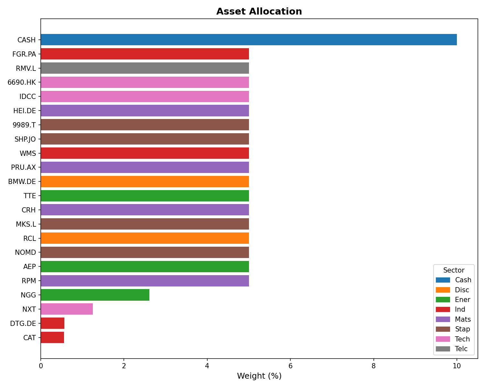

# Black-Litterman Portfolio Construction

A Black-Litterman allocation model built for a student-run investment fund. It combines an equilibrium prior with analyst return views and solves for optimal weights under the fund's investment mandate constraints. The mandate also specifies Black-Litterman as the allocation model, which is why the results are not compared to alternative models. 

## Data

Four years of daily prices for 25 listed equities, adjusted for dividends and stock splits. The universe spans seven sectors:

| Abbreviation | Sector |
|---|---|
| Ind | Industrials |
| Mats | Materials |
| Tech | Technology |
| Stap | Consumer Staples |
| Disc | Consumer Discretionary |
| Telc | Telecoms |
| Ener | Energy |


## Method

The Black-Litterman model treats the market equilibrium as a prior and analyst views as evidence to produce a posterior expected return that blends the two:

$$
E[R] = [(\tau \Sigma)^{-1} + P^{\mathsf{T}} \Omega^{-1} P]^{-1} [(\tau \Sigma)^{-1} \pi + P^{\mathsf{T}} \Omega^{-1} Q]
$$

The code does the following:

1. Download four years of daily prices for the 25 asset universe using yfinance.
2. Estimate the Ledoit-Wolf shrunk covariance matrix and annualise it.
3. Reverse-optimise the weights to get implied excess returns `pi = risk_aversion * Sigma * w`. Equal weights are used in place of market capitalisation weights, so `pi reflects each asset's covariance with the equal-weighted universe rather than with the market portfolio.
4. Build the view matrix `P`, the view vector `Q` and the view uncertainty `Omega`. Views are absolute one-year return forecasts, taken from median analyst estimates and converted to excess returns over a fixed risk-free rate. `Omega` is set proportional to the prior variance.
5. Combine prior and views into the posterior mean and covariance.
6. Maximise `mu'w - 0.5 * risk_aversion * w'Sigma w` subject to the constraints, using the OSQP solver.

## Constraints

| Constraint | Value |
|---|---|
| Long only | w >= 0 |
| Invested | 90%, with 10% held in cash |
| Single position | max 5% |
| Single sector | max 20% |

## Results





The optimal weights are written to `results/optimal_weights.xlsx`. As expected under the given constraints, most assets receive the maximum 5% allocation. 


## Running it

```bash
pip install -r requirements.txt
python black_litterman.py
```

